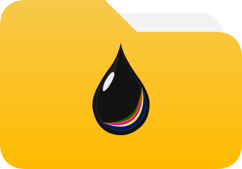

  

<h1 align="center">octattoo.app</h1>

<strong>Tattoo & stay organized!</strong>

---

## What is octattoo.app?

**octattoo.app** is a modern business management application designed specifically for tattoo artists. Whether you're just starting your career or you're a seasoned professional, this app helps you manage appointments, clients, inventory, invoices, and all the paperwork that comes with running a tattoo business — all in one place.

### Why This Matters

Tattoo artists are both **artists and entrepreneurs**. Creativity is essential, but administrative tasks can consume time and mental energy. octattoo.app handles the organization so artists can focus on what matters most: **tattooing**.

The tattoo industry has evolved — from how artists communicate with clients to how they manage their businesses. This tool adapts to all generations of artists and their unique workflows, whether working in a studio, guest spotting, or running an independent shop.

---

## Key Features

### 📱 **Go Paperless**
Everything that used to be on paper — consent forms, stencils, invoices, client records — becomes digital. Easy to search, archive, and keep secure.

### 🌍 **Works Everywhere**
Planned availability across:
- **Mobile** (Android & iPhone)
- **Tablet** (Android & iPad)
- **Desktop** (Windows, macOS, Linux)
- **Web Browser** (access from anywhere)

### 🎨 **Flexible & Intuitive**
Every tattoo artist works differently. The app provides helpful structure for beginners while remaining flexible for experienced artists with established workflows.

### 🔒 **Robust & Secure**
Client data, business records, and artwork are protected. The app is built with **integrity, security, and availability** as core foundations.

### 🌐 **Multilingual**
Launching in **French, English, and Arabic**, with more languages planned. Supports both left-to-right (LTR) and right-to-left (RTL) reading.

### 💡 **Transparent & Open**
All code, documentation, and the development journey are published openly on GitHub. See exactly how the app works.

### 📤 **Your Data, Your Freedom**
Export everything in open formats. The app will never lock you in — you own your data and can take it with you anytime.

---

## Business-Oriented for Tattoo Artists

octattoo.app is designed to meet the **specific needs of tattoo businesses**, including:

- ✅ Traceability of needles and inks used during sessions
- ✅ Client management and appointment booking
- ✅ Inventory tracking for supplies
- ✅ Invoice and quote generation
- ✅ Project portfolio management
- ✅ Consent forms and health documentation

---

## Pricing & Accessibility

A **subscription-based model** designed to be as affordable as possible. The goal is to provide a valuable tool at the **lowest price with minimal friction**.

**Free trial** available with limited features (one client, one workplace, one invoice, etc.). Monthly subscription unlocks full capabilities.

---

## Built with Modern, Open Technology

For **Flutter and Serverpod enthusiasts**:

### Tech Stack
- **Frontend**: [Flutter](https://github.com/flutter/flutter) with Material Design 3 and Material You color schemes
- **Backend**: [Serverpod](https://github.com/serverpod/serverpod)
- **Infrastructure as Code**: [Terraform](https://github.com/hashicorp/terraform)
- **Hosting**: OVHCloud (European, independent alternative to Big Tech)
- **Version Control**: GitHub mono-repo (frontend, backend, docs, website — everything in one place)

### Why These Choices?
- **Flutter** enables beautiful, high-performance apps across all platforms from a single codebase
- **Serverpod** provides a robust, type-safe backend built specifically for Dart and Flutter
- **Open standards** ensure transparency, flexibility, and community contribution
- **European hosting** maintains data sovereignty and avoids dependency on major US cloud providers

---

## The Vision

**Improve organization, productivity, and quality for tattoo artists worldwide** on a daily basis, enabling them to devote more time to tattooing and creativity.

### Core Values
This project is guided by:
- 🗽 **Freedom** — your data, your way
- ⚖️ **Equality** — accessible to all artists worldwide
- ⚖️ **Justice** — fair pricing and transparent practices
- 🤝 **Solidarity** — supporting the tattoo community
- 🌈 **Pluralism** — welcoming all artists, styles, and cultures
- 🚀 **Progress** — continuous improvement and innovation

---

## The Development Journey

This project has been in development for over **two years**. It's not rushed to market. Every feature, every design decision, and every line of code is crafted with care to meet the real needs of tattoo artists.

### The Origin
The project was born from witnessing the challenges tattoo artists face when setting up and managing their businesses. It's being built by an IT project manager with 10 years of experience who taught themselves Dart, Flutter, and software engineering to create a solution that truly serves the tattoo community.

This is a solo endeavor, built without a large budget but with dedication to follow best practices and regulations. The goal is to offer not just an application, but a **standard for tattoo business management**.

---

## Documentation & Resources (Planned)

Comprehensive documentation will be available at:

- 🌐 **Main Website** *(planned)*: [octattoo.app](https://octattoo.app) — app info, features, subscriptions
- 📖 **User Documentation** *(planned)*: [userdocs.octattoo.app](https://userdocs.octattoo.app) — how to use the app
- 🛠️ **Technical Documentation** *(planned)*: [devdocs.octattoo.app](https://devdocs.octattoo.app) — for developers and tech enthusiasts following the entire journey

---

## Ambition

**Anywhere in the world**, octattoo.app aims to be the **first app anyone downloads** when starting a tattoo artist career. No other tool on the market offers a tattoo business-oriented solution with full traceability of needles, inks, and all the administrative needs of a professional tattoo business.

---

## Current Status

This is an **active, ongoing project**. The repository currently contains:
- ✅ Vision and planning documents
- 🚧 Frontend and backend skeleton (Serverpod-generated structure)
- 📝 Development journey documentation
- 🎯 Roadmap for features and functionality

All development is done **transparently and openly** on GitHub. This repository tracks the complete journey from concept to launch.

---

## Repository Structure

This is a **mono-repo** containing everything related to octattoo.app:
- Application code (frontend & backend)
- Infrastructure as Code (Terraform)
- User documentation
- Technical documentation
- Design assets
- Development journey notes

---

## Following the Journey

If you're a tattoo artist curious about the app, a Flutter/Serverpod enthusiast interested in the tech stack, or a technophile who appreciates well-crafted digital products, you're welcome here.

**Star this repo** to follow along as the application takes shape. Updates, documentation, and releases coming soon.

---

## License

Details coming soon. The project embraces open standards and transparency.

---

  <strong>Made with dedication for the tattoo community 🖤</strong>

